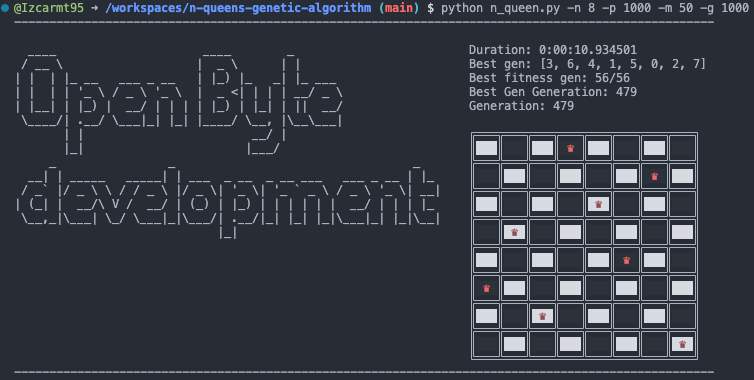
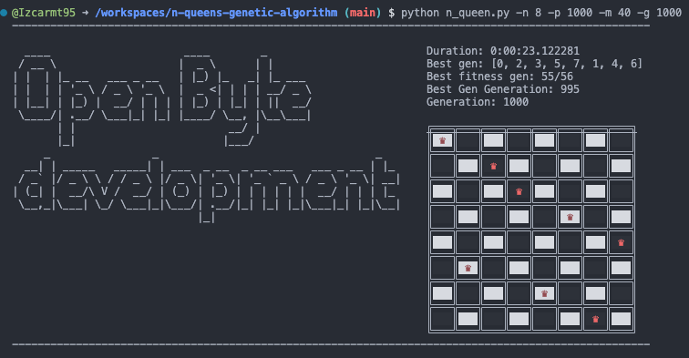

# Genetic Algorithm for Solving NQueens Problem

## Introduction

This is a simple implementation of the [Genetic Algorithm](https://en.wikipedia.org/wiki/Genetic_algorithm) for solving the [N-Queens problem](https://en.wikipedia.org/wiki/Eight_queens_puzzle).

The N-Queens problem is to place N queens on an N×N chessboard so that no two queens attack each other.

The problem can be stated as follows:

> Given an integer N, place N queens on an N×N chessboard so that no two queens attack each other.

>> Note: This solution is not optimal. It is just a simple implementation.

### Requirements
- Python 3.8+
- Colorama (for colored output)

## Installation
- Create a virtual environment and install dependencies

    ```bash
    $ python3 -m venv env
    $ source env/bin/activate
    $ pip install -r requirements.txt
    ```
- Run the program

    ```bash
    $ python3 n_queen.py
    ```

- Run the program with the `--help` flag to see the available options
- Run the program with the arguments:
    
    ```bash 
    $ python n_queen.py --n-queen 10 --population 1000 --mutation-probability 40 --generations 1000
    ## or
    $ python n_queen.py -n 10 -p 1000 -m 40 -g 1000
    ```
## Implementation Details

The algorithm is implemented in the following steps:

1. Generate a random population of N-queens solutions.
2. Evaluate the fitness of each solution.
3. Select the best solutions from the population.
4. Cross-over the best solutions to generate new solutions.
4. Repeat the above steps until the termination condition is met.

The termination condition is when the best solution is found or generation limit is reached.


## Implementation

### Generate a random population of N-queens solutions
```python
def _create_generation(self) -> None:
        """
        Create new generation
        """
        self.current_generation += 1
        new_population: List[Gen] = []
        population = self.population ## copy of population optimization
        length_population = len(population) - 1 ## we want to position 0 to length - 1
        
        for _ in range(length_population):
            ## Gen selection 1 (tournament selection)
            gen_1 = population[random.randint(0, length_population)]
            gen_2 = population[random.randint(0, length_population)]
            selected_gen_1 = gen_1 if gen_1.fitness < gen_2.fitness else gen_2

            ## Gen selection 2 (tournament selection)
            gen_1 = population[random.randint(0, length_population)]
            gen_2 = population[random.randint(0, length_population)]
            selected_gen_2 = gen_1 if gen_1.fitness < gen_2.fitness else gen_2
            
            ## crossover and mutation
            new_gen = self._crossover(selected_gen_1, selected_gen_2)
            new_population.append(new_gen)
        
        new_population.append(self.best_gen)
        
        self.population = new_population
```
### Crossover and mutation
```python
def _crossover(self, gen_1: Gen, gen_2: Gen) -> Gen:
        """
        index = random.randint(0, self.n_queen - 1) => 3 random crossover 
        gen1: [3,4,2,1,0,5,6,7]
        gen2: [4,3,2,7,1,3,5,7]
        new_gen: gen1[0:3] + gen2[3:n_queen - 1] = [3,4,2,7,1,3,5,7]

        ## mutation
        gen = [3,4,2,7,1,3,6,7]
        mutated_gen = [3,*1,2,7,1,3,*5,7] ## * is a placeholder for mutation
        """
        n_queen = self.n_queen
        index = random.randint(0, n_queen - 1)
        gen_solution = gen_1.gen[0:index] + gen_2.gen[index:]
        

        # mutation: value of new_gen
        mutation_probability = self.mutation_probability
        for i in range(n_queen):
            if random.randint(0, 100) < mutation_probability:
                gen_solution[i] = random.randint(0, n_queen - 1)
                
        new_gen = Gen(gen=gen_solution, generation=self.current_generation)
        
        return new_gen
        
```
### Evaluate the fitness of each solution
```python
def _calculate_fitness(self) -> int:
        """
        Calculate fitness of the gen
        """
        
        fitness = 0
        gen = self.gen
        for q_row, q_column in enumerate(gen):
            for q_row2, q_column2 in enumerate(gen[q_row + 1:], start=q_row + 1):
                row_diff = abs(q_row - q_row2)
                col_diff = abs(q_column - q_column2)
                if row_diff == col_diff:
                    # diagonal conflict
                    fitness += 1

                # same column [1,0, 1] row 0 and row 2 have same column
                elif q_column == q_column2:
                    # same row conflict
                    fitness += 1

                else:
                    # no conflict
                    fitness += 2

        return fitness
```


### Solve the N-Queens problem
```python
def solve(self, generation_number) -> int:
    """
    Return number of generations needed to solve the problem
    if no solution found return -1
    """
    
    solved_generation = 0
    best_fitness = self.best_fitness
    if self.best_gen.fitness == best_fitness:
        generation = solved_generation
    
    else:
        for k in range(generation_number):
            self._create_generation()
            
            if self.best_gen.fitness == best_fitness:
                generation  = solved_generation + k
            
        generation = -1
    
    return generation
```
## Examples:

1 - When the N-Queens **problem is solved**, the following is printed:

```bash
$ python n_queen.py --n-queen 8 --population 1000 --mutation-probability 35 --generations 5000
```



2 - When the N-Queens problem **is not solved**, the following is printed:

```bash
$ python n_queen.py --n-queen 8 --population 100 --mutation-probability 35 --generations 500
```

